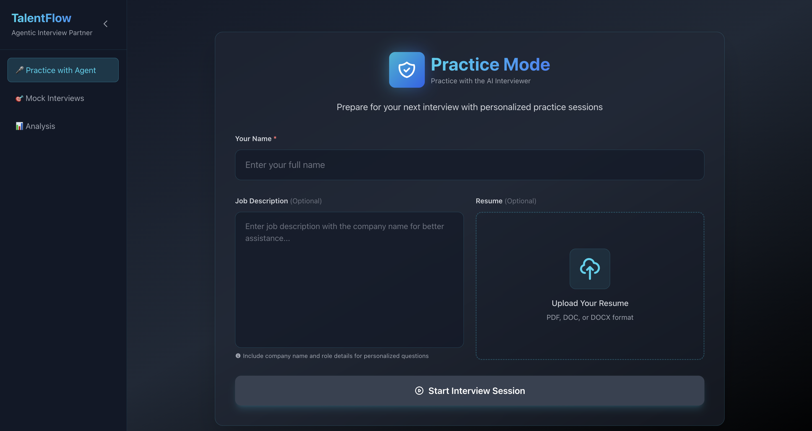
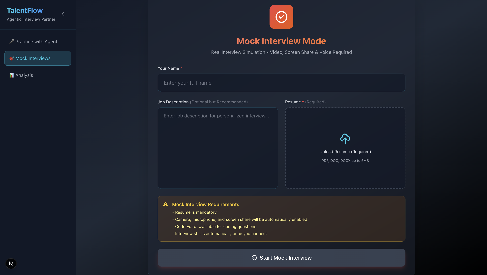
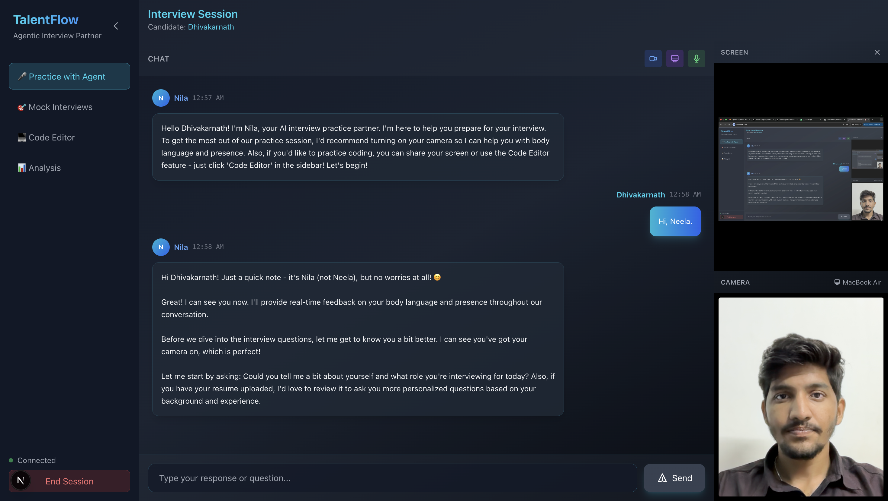
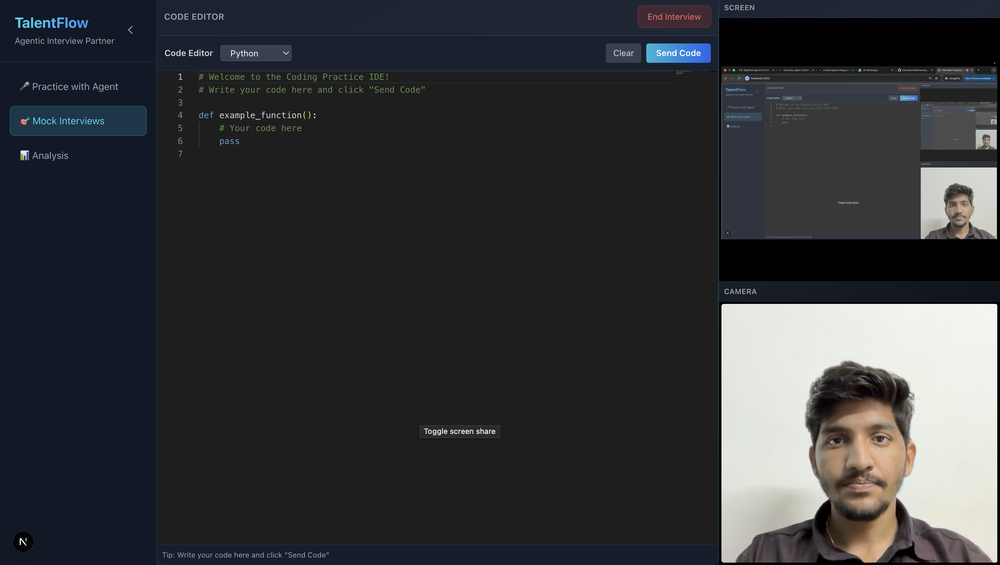
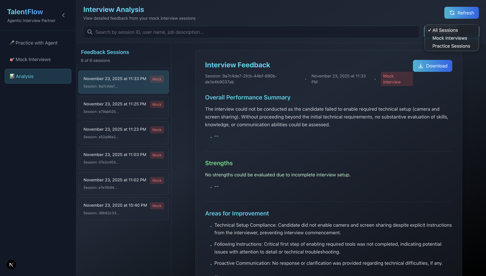
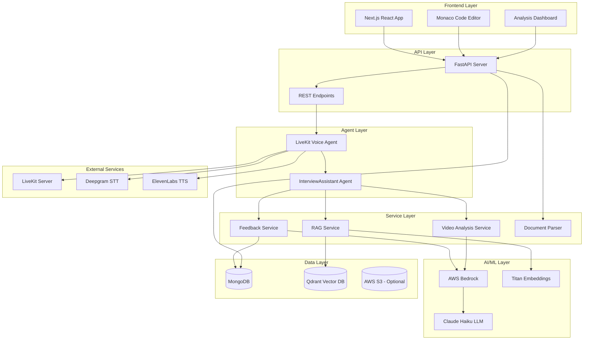
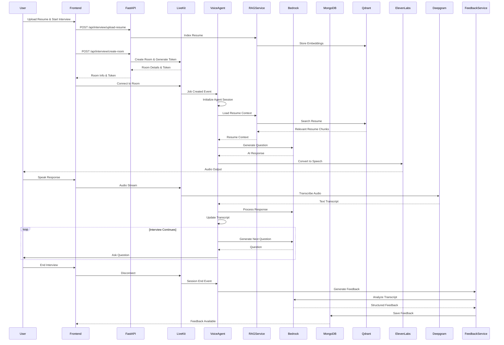
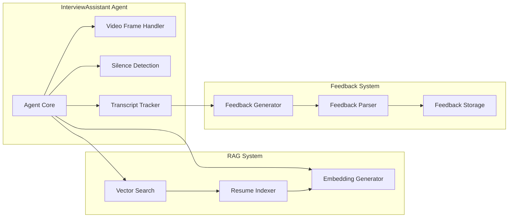

# TalentFlow - Agentic Interview Partner

An intelligent, real-time interview practice platform powered by AI that provides personalized interview coaching with voice, video, and screen sharing capabilities. The system offers both practice sessions and realistic mock interviews with comprehensive feedback generation.

## Table of Contents

- [Features](#features)
- [Screenshots](#screenshots)
- [Architecture](#architecture)
- [Design Decisions](#design-decisions)
- [Technology Stack](#technology-stack)
- [Setup Instructions](#setup-instructions)
- [Architecture Notes](#architecture-notes)
- [API Documentation](#api-documentation)
- [Project Structure](#project-structure)

## Features

### Core Capabilities

- **Real-Time Voice Interaction**: Natural conversation flow with AI interviewer using LiveKit for WebRTC communication
- **Video Analysis**: Body language and presence analysis using AWS Bedrock multimodal capabilities
- **Screen Share Analysis**: Code review and technical assessment during coding interviews
- **Resume-Based Personalization**: RAG (Retrieval Augmented Generation) system using Qdrant vector database for context-aware questions
- **Dual Interview Modes**:
  - **Practice Mode**: Supportive coaching with real-time feedback
  - **Mock Interview Mode**: Realistic interview simulation with strict requirements and post-interview feedback
- **Post-Interview Feedback**: Automated feedback generation with structured analysis including strengths, weaknesses, and improvement areas
- **Code Editor Integration**: Built-in Monaco Editor for coding practice with syntax highlighting
- **Feedback Management**: View, search, and download interview feedback from the Analysis dashboard

## Screenshots

### Practice with Agent Mode

The Practice Mode interface allows candidates to prepare for interviews with personalized coaching and real-time feedback.



*Practice Mode setup page with name, job description, and resume upload options*

### Mock Interview Mode

Mock Interview Mode provides a realistic interview simulation with strict requirements for camera, microphone, and screen sharing.



*Mock Interview setup page with mandatory requirements and interview guidelines*

### Active Interview Session

During an active interview session, candidates interact with Nila (the AI interviewer) through real-time voice, video, and chat.



*Live interview session showing chat interface, camera feed, and screen share*

### Code Editor

Built-in Monaco Editor for coding practice with syntax highlighting and direct code submission to the AI interviewer.



*Code editor interface with Python support and screen share preview*

### Interview Analysis Dashboard

Comprehensive feedback analysis dashboard showing all interview sessions with search, filter, and download capabilities.



*Analysis dashboard displaying feedback sessions, detailed feedback, and download options*

### Advanced Features

- **Silence Detection**: Automatic prompting if candidate remains silent for 5 seconds
- **Screen Monitoring**: Detection of navigation away from interview application
- **Transcript Tracking**: Complete conversation logging for feedback generation
- **Multi-modal Context**: Integration of camera, screen share, and audio streams for comprehensive assessment

## Technology Stack

### Backend

- **Framework**: FastAPI 0.118.0
- **Voice Agent**: LiveKit Agents SDK 1.2.14
- **LLM**: AWS Bedrock (Claude Haiku)
- **Embeddings**: Amazon Titan Embeddings v2
- **Vector Database**: Qdrant 1.9.0
- **Document Database**: MongoDB (Motor 3.3.2)
- **STT**: Deepgram Nova-3
- **TTS**: ElevenLabs Flash v2.5
- **Video Processing**: PyAV 15.1.0
- **Document Parsing**: PyPDF2, python-docx

### Frontend

- **Framework**: Next.js 15.5.2 (React 19)
- **Real-Time Communication**: LiveKit Components React 2.9.15
- **Code Editor**: Monaco Editor 0.55.1
- **Styling**: Tailwind CSS 3.4.1
- **Language**: TypeScript 5

### Infrastructure

- **Real-Time Communication**: LiveKit Server
- **Cloud Services**: AWS Bedrock, AWS S3 (optional)
- **Databases**: MongoDB, Qdrant

## Architecture

### System Architecture



### Interview Session Flow



### Component Interaction



## Setup Instructions

### Clone the Repository

```bash
git clone https://github.com/Dhivakarnath/Interview_Agent.git
cd Interview_Agent
```

### Prerequisites

- **Python**: 3.10 or higher
- **Node.js**: 18.x or higher
- **MongoDB**: 4.4 or higher (running locally or remote)
- **Qdrant**: 1.0 or higher (optional, for resume search)
- **LiveKit Server**: Running instance (cloud or self-hosted)
- **AWS Account**: With Bedrock access configured
- **API Keys**: Deepgram, ElevenLabs

### Backend Setup

1. **Navigate to backend directory**:
```bash
cd backend
   ```

2. **Create and activate virtual environment**:
   ```bash
   python3 -m venv venv
   source venv/bin/activate  # On Windows: venv\Scripts\activate
   ```

3. **Install dependencies**:
   ```bash
pip install -r requirements.txt
```

4. **Configure environment variables**:
   ```bash
   # Copy the template file
   cp ../env.template .env
   
   # Edit .env with your configuration
   # Required variables:
   # - AWS_REGION, AWS_ACCESS_KEY_ID, AWS_SECRET_ACCESS_KEY, AWS_SESSION_TOKEN
   # - BEDROCK_MODEL_ID
   # - LIVEKIT_URL, LIVEKIT_API_KEY, LIVEKIT_API_SECRET
   # - DEEPGRAM_API_KEY
   # - ELEVENLABS_API_KEY
   # - MONGODB_URL (default: mongodb://localhost:27017)
   # - QDRANT_URL, QDRANT_API_KEY, QDRANT_COLLECTION_PREFIX
   ```

5. **For development/testing, export AWS credentials** (optional):
   ```bash
   export AWS_ACCESS_KEY_ID="your-access-key-id"
   export AWS_SECRET_ACCESS_KEY="your-secret-access-key"
   export AWS_SESSION_TOKEN="your-session-token"
   ```

6. **Initialize MongoDB** (if running locally):
   ```bash
   # Ensure MongoDB is running
   brew install mongodb-community
   brew services start mongodb-community
   ```

7. **Start FastAPI server**:
```bash
python main.py
   # Server runs on http://localhost:8000
   ```

8. **Download LiveKit agent dependencies** (first time only):
   ```bash
   python voice/voice_agent.py download-files
   ```

9. **Start the voice agent** (in a separate terminal):
```bash
   cd backend
   source venv/bin/activate
python voice/voice_agent.py dev
```

### Frontend Setup

1. **Navigate to frontend directory**:
```bash
cd frontend
   ```

2. **Install dependencies**:
   ```bash
npm install
```

3. **Run development server**:
```bash
npm run dev
   # Application runs on http://localhost:3000
   ```

### Verification

1. **Check backend health**:
   ```bash
   curl http://localhost:8000/api/health
   ```

2. **Verify MongoDB connection**:
   - Check backend logs for "MongoDB connected successfully"
   - Verify feedback collection exists

3. **Test frontend**:
   - Open http://localhost:3000
   - Verify all tabs load correctly

### Running the Complete System

1. **Terminal 1 - FastAPI Backend**:
   ```bash
   cd backend
   source venv/bin/activate
   python main.py
   ```

2. **Terminal 2 - Voice Agent**:
   ```bash
   cd backend
   source venv/bin/activate
   python voice/voice_agent.py dev
   ```

3. **Terminal 3 - Frontend**:
   ```bash
   cd frontend
   npm run dev
   ```

4. **Access the application**:
   - Open http://localhost:3000 in your browser
   - Start an interview session

## Architecture Notes

### System Design Principles

1. **Microservices Architecture**: Separation of concerns with distinct services for RAG, feedback, and video analysis
2. **Event-Driven Communication**: LiveKit events drive agent behavior and session management
3. **Asynchronous Processing**: All I/O operations are async to handle concurrent sessions
4. **Modular Agent Design**: InterviewAssistant extends LiveKit Agent with custom video and transcript handling

### Key Components

#### 1. FastAPI Backend (`backend/main.py`)

**Responsibilities**:
- REST API endpoints for room creation and resume upload
- Session management and tracking
- Feedback retrieval endpoints
- MongoDB connection management

**Key Endpoints**:
- `POST /api/interview/upload-resume`: Upload and index resume
- `POST /api/interview/create-room`: Create LiveKit room and generate token
- `GET /api/feedback/user/{user_name}`: Retrieve user feedback
- `GET /api/feedback/{session_id}`: Retrieve session-specific feedback

#### 2. Voice Agent (`backend/voice/voice_agent.py`)

**Responsibilities**:
- Real-time voice interaction using LiveKit Agents SDK
- Video frame sampling and analysis
- Silence detection and prompting
- Transcript tracking for feedback generation
- Session lifecycle management

**Key Features**:
- **InterviewAssistant Class**: Extends LiveKit Agent with custom video handling
- **Video Stream Processing**: Samples camera and screen share frames
- **Silence Monitoring**: Background task for 5-second silence detection
- **Transcript Management**: Tracks all conversation messages for feedback

#### 3. RAG Service (`backend/services/rag_service.py`)

**Responsibilities**:
- Resume indexing using Titan embeddings
- Vector similarity search in Qdrant
- Context retrieval for personalized questions

**Architecture**:
- **Embedding Generation**: AWS Bedrock Titan Embeddings v2
- **Vector Storage**: Qdrant with cosine similarity search
- **Chunking Strategy**: Paragraph-based chunking (500 chars)
- **User Isolation**: Filtered searches by user_name

#### 4. Feedback Service (`backend/services/feedback_service.py`)

**Responsibilities**:
- Post-interview feedback generation using Claude
- Structured feedback parsing
- Feedback storage in MongoDB

**Process Flow**:
1. Transcript conversion to readable format
2. Prompt engineering for structured feedback
3. LLM generation via AWS Bedrock
4. Section extraction and parsing
5. MongoDB storage

#### 5. Video Analysis Service (`backend/services/video_analysis_service.py`)

**Responsibilities**:
- Body language analysis from camera frames
- Code analysis from screen share frames
- Multimodal prompt construction for Bedrock

**Capabilities**:
- Base64 image encoding
- Context-aware prompts
- Structured analysis output

#### 6. Frontend (`frontend/app/page.tsx`)

**Responsibilities**:
- User interface for interview sessions
- LiveKit room connection management
- Real-time chat and transcription display
- Code editor integration
- Feedback analysis dashboard

**Key Components**:
- **Practice Mode**: Supportive coaching interface
- **Mock Interview Mode**: Realistic interview simulation
- **Analysis View**: Feedback browsing and download
- **IDE Component**: Monaco Editor for code practice

### Data Flow

#### Resume Upload Flow

```
User Uploads Resume
    ↓
FastAPI receives file
    ↓
Document Parser extracts text
    ↓
RAG Service chunks text
    ↓
Titan Embeddings generate vectors
    ↓
Qdrant stores vectors with metadata
    ↓
Resume indexed and searchable
```

#### Interview Session Flow

```
User Starts Interview
    ↓
FastAPI creates LiveKit room
    ↓
Frontend connects to room
    ↓
Voice Agent receives job event
    ↓
Agent loads resume context via RAG
    ↓
Agent generates personalized questions
    ↓
Real-time conversation begins
    ↓
Transcript tracked throughout session
    ↓
Session ends → Feedback generated
    ↓
Feedback saved to MongoDB
```

#### Feedback Generation Flow

```
Session Ends
    ↓
Transcript collected
    ↓
Feedback Service processes transcript
    ↓
Prompt constructed with context
    ↓
Claude generates structured feedback
    ↓
Feedback parsed into sections
    ↓
Stored in MongoDB
    ↓
Available in Analysis dashboard
```

### Database Schema

#### MongoDB - Feedback Collection

```javascript
{
  _id: ObjectId,
  session_id: String (unique, indexed),
  user_name: String (indexed),
  interview_mode: String,
  job_description: String,
  feedback_text: String,
  sections: {
    "Overall Performance Summary": String,
    "Strengths (with Scores)": String,
    "Weaknesses (with Scores)": String,
    "Areas for Improvement Summary": String,
    "Overall Scores": String
  },
  created_at: Date (indexed),
  updated_at: Date
}
```

#### Qdrant - Resume Collection

```python
{
  id: int64,
  vector: {
    "text-dense": [float]  # 1024-dimensional embedding
  },
  payload: {
    "text": String,
    "source": "resume",
    "user_name": String,
    "resume_id": String,
    "chunk_index": int,
    "total_chunks": int
  }
}
```

### Security Considerations

1. **Environment Variables**: Sensitive credentials stored in `.env` (not committed)
2. **JWT Tokens**: LiveKit tokens generated server-side with expiration
3. **CORS**: Configured for development (should be restricted in production)
4. **Input Validation**: Pydantic models for request validation
5. **Database Indexing**: Indexes on frequently queried fields

### Performance Optimizations

1. **Async Operations**: All database and API calls are asynchronous
2. **Connection Pooling**: MongoDB connection reuse
3. **Vector Search**: Efficient similarity search in Qdrant
4. **Transcript Batching**: Efficient transcript storage
5. **Video Frame Sampling**: Selective frame processing to reduce load

## Design Decisions

This section documents the key architectural and technology decisions made during the development of TalentFlow, with a focus on productionization, scalability, and AWS cloud-native architecture.

### 1. Technology Choices

#### 1.1 Real-Time Communication: LiveKit Agents SDK

**Decision**: Use LiveKit Agents SDK as the core framework for real-time voice interaction

**Rationale**:
- **Cost Efficiency**: Significantly more cost-effective than alternatives like Twilio or Agora, with flexible pricing models suitable for high-volume usage
- **Low Latency**: Optimized WebRTC implementation provides lower latency, critical for natural voice conversations and agentic tool invocation
- **AWS Integration**: Seamless integration with AWS services through LiveKit's egress capabilities for S3 storage
- **Production-Ready Infrastructure**: Enterprise-grade WebRTC infrastructure with built-in scalability
- **Rich Feature Set**: Comprehensive agent framework with built-in support for STT, TTS, video processing, and turn detection
- **Multi-Language Support**: Native support for multilingual turn detection (English, Hindi, and 100+ languages) through MultilingualModel
- **Flexibility**: Self-hostable or cloud-hosted options, providing deployment flexibility
- **Developer Experience**: Well-documented SDK with excellent TypeScript and Python support
- **Agentic Tool Support**: Native support for function tools enables seamless RAG integration with minimal latency

**Key Capabilities Leveraged**:
- Real-time audio/video streaming via WebRTC with optimized latency
- Agent lifecycle management
- Event-driven architecture for session handling
- Egress capabilities for recording storage to S3
- Built-in noise cancellation and audio processing
- Function tool invocation with low-latency execution

**Latency Advantages**:
- **Sub-100ms Audio Latency**: Enables natural conversation flow without noticeable delays
- **Efficient Tool Invocation**: RAG tool calls execute within the same process, eliminating network round-trips
- **Streaming Architecture**: Real-time streaming enables immediate responses and tool invocation
- **Optimized Agent Responses**: Combined with efficient RAG retrieval, enables responsive, natural conversations

**Production Benefits**:
- Lower operational costs compared to proprietary solutions
- AWS-native integration for seamless cloud workflows
- Horizontal scalability through worker distribution
- Enterprise-grade reliability and uptime
- Superior latency performance for real-time AI interactions

#### 1.2 LLM Provider: AWS Bedrock

**Decision**: Use AWS Bedrock with Claude Haiku for all LLM operations

**Rationale**:
- **Productionization Focus**: Enterprise-grade security, compliance, and reliability required for production deployment
- **Cost Optimization**: Pay-per-use pricing model with significant cost advantages over API-based solutions for high-volume usage
- **Regional Availability**: Multi-region support including `ap-south-1` for optimal latency
- **Model Flexibility**: Access to multiple models (Claude, Titan) from a single API
- **AWS Ecosystem Integration**: Native integration with other AWS services (S3, DocumentDB, Lambda)
- **Security & Compliance**: Built-in encryption, IAM integration, and compliance certifications
- **Scalability**: Automatic scaling without infrastructure management

**Model Selection**:
- **Claude Haiku**: Fast, cost-effective model for conversational AI and feedback generation
- **Titan Embeddings v2**: High-quality embeddings (1024 dimensions) for RAG operations

**Cost Optimization Strategies**:
- Efficient prompt engineering to minimize token usage
- Caching strategies for common queries
- Batch processing capabilities
- Regional selection for optimal pricing

#### 1.3 Speech-to-Text: Deepgram Nova-3

**Decision**: Deepgram Nova-3 multilingual model for speech transcription

**Rationale**:
- **Multi-Language Support**: Native support for English and Hindi, with 100+ language support
- **Accuracy**: State-of-the-art accuracy with low latency
- **Real-Time Processing**: Streaming transcription capabilities
- **Cost Efficiency**: Competitive pricing for production workloads
- **API Reliability**: Enterprise-grade uptime and support

**Language Support**:
- English (en-US): Primary language with optimized accuracy
- Hindi (hi-IN): Full support for Hindi interviews
- Extensible to additional languages as needed

#### 1.4 Text-to-Speech: ElevenLabs Flash v2.5

**Decision**: ElevenLabs Flash v2.5 for natural voice synthesis

**Rationale**:
- **Voice Quality**: Natural, human-like voice synthesis
- **Low Latency**: Flash model optimized for real-time applications
- **Customization**: Voice settings for stability, similarity, and speed control
- **Cost Efficiency**: Flash model provides excellent quality-to-cost ratio
- **Integration**: Seamless integration with LiveKit Agents SDK

### 2. Architecture Patterns

#### 2.1 Service-Oriented Architecture with AWS-Native Services

**Decision**: Hybrid microservices approach with clear service boundaries and AWS-native integrations

**Rationale**:
- **Independent Scaling**: Each service (RAG, Feedback, Video Analysis) can scale independently based on demand
- **Clear Separation of Concerns**: Modular design enables easier testing, maintenance, and feature development
- **AWS Integration**: Services designed to integrate seamlessly with AWS services (S3, DocumentDB, Bedrock)
- **Production Readiness**: Architecture supports production deployment patterns from the start

**Service Boundaries**:
- **FastAPI Backend**: REST API and session management
- **Voice Agent**: Real-time interaction and transcript tracking
- **RAG Service**: Resume indexing and retrieval
- **Feedback Service**: Post-interview analysis and generation
- **Video Analysis Service**: Multimodal frame analysis

#### 2.2 Event-Driven Agent Communication

**Decision**: Use LiveKit events for agent lifecycle and real-time communication

**Rationale**:
- **Decoupled Components**: Event-driven architecture enables loose coupling between components
- **Real-Time Responsiveness**: Immediate reaction to room events, track subscriptions, and user actions
- **Natural Fit**: WebRTC events map naturally to interview session lifecycle
- **Scalability**: Event-driven pattern supports horizontal scaling of agent workers

**Key Events Utilized**:
- `RoomEvent.Connected`: Initialize agent session
- `track_subscribed`: Handle video track subscriptions
- `TTSMetrics`: Track agent speech completion for silence detection
- `JobContext` shutdown: Trigger feedback generation

#### 2.3 RAG (Retrieval Augmented Generation) Pattern with Agentic Tool Integration

**Decision**: Implement RAG as a function tool integrated into the voice agent for fully autonomous, agentic decision-making

**Rationale**:
- **Personalization Without Fine-Tuning**: Achieve personalized questions without expensive model fine-tuning
- **Fully Agentic Behavior**: The agent autonomously decides when to use the RAG tool based on conversation context, making natural decisions without explicit instructions
- **Efficient Context Retrieval**: Vector similarity search provides relevant context quickly
- **Scalability**: Supports multiple users with unique resume storage per username
- **Cost Efficiency**: Reduces LLM context window usage by retrieving only relevant information
- **Production Ready**: Vector search scales efficiently with proper indexing
- **Low Latency**: LiveKit's optimized WebRTC infrastructure ensures minimal latency for real-time tool invocation and response

**Implementation Details**:
- **Tool Integration**: RAG service exposes `search_candidate_info` as a function tool that the agent can invoke autonomously
- **Agentic Decision Making**: The agent naturally decides when to search the resume based on conversation flow, without being explicitly told to do so
- **Silent Operation**: Tool usage is transparent to the user - the agent uses retrieved information naturally in questions without mentioning the search process
- **Unique Storage**: Resumes stored uniquely per `user_name` in Qdrant, enabling multi-user isolation
- **Chunking Strategy**: Paragraph-based chunking (500 chars) for optimal retrieval
- **Embedding Model**: AWS Titan Embeddings v2 (1024 dimensions) for high-quality semantic search
- **Search Filtering**: User-specific filtering ensures privacy and relevance

**Agentic Tool Behavior**:
- The agent autonomously invokes the RAG tool when it needs resume context to ask personalized questions
- Tool invocation happens naturally during conversation flow - the agent decides based on context
- No explicit instructions needed - the agent understands when resume information would be helpful
- Seamless integration with conversation - retrieved information flows naturally into questions

**LiveKit Latency Benefits**:
- **Optimized WebRTC**: LiveKit's WebRTC implementation provides sub-100ms latency for real-time communication
- **Efficient Tool Invocation**: Tool calls happen within the same process, eliminating network overhead
- **Streaming Architecture**: Real-time streaming enables immediate tool invocation without waiting for complete responses
- **Low-Latency Agent Responses**: Combined with efficient RAG retrieval, enables natural, responsive conversations

#### 2.4 Agentic Behavior & Persona Handling

**Decision**: Implement dynamic prompt adaptation and intelligent handling based on user interaction patterns

**Rationale**:
To satisfy the "Intelligence & Adaptability" evaluation criteria, the agent needs to handle diverse user personas and edge cases gracefully. The system implements multiple mechanisms to adapt to different user behaviors and maintain natural conversation flow.

**Implementation Details**:

**The Silent User**:
- **Background Monitoring Task**: Continuous silence detection running at 1-second intervals (`monitor_silence_continuously`)
- **Multiple Detection Mechanisms**: 
  - TTSMetrics events for reliable agent speech completion detection
  - Wrapped `session.say()` function to track agent speech timestamps
  - `on_agent_turn_completed()` as backup detection mechanism
- **Progressive Prompting**: After 5 seconds of silence, the agent provides supportive nudges:
  - "Are you still there? Please respond."
  - "Can you hear me? Please answer the question."
  - "I'm waiting for your response. Please proceed."
- **Flag-Based Prevention**: `_is_checking_silence` flag prevents duplicate prompts
- **Context-Aware**: Silence detection considers conversation context and interview mode

**The Chatty User**:
- **Prompt Engineering**: System prompts explicitly instruct the agent to handle chatty users:
  - "Listen actively, acknowledge their points, gently redirect when needed"
  - "If the candidate goes off-topic, gently redirect back to the interview focus"
  - "Acknowledge briefly, then redirect: 'That's interesting. Let me ask you about...'"
- **Steering Mechanism**: The agent acknowledges off-topic anecdotes but firmly steers conversation back to interview questions
- **Natural Redirection**: Uses conversational techniques like "That's interesting. Let me ask you about..." to maintain focus
- **Professional Boundaries**: Maintains interview structure while respecting user's communication style

**The Confused User**:
- **Patient Clarification**: System prompts instruct: "Be patient, provide clarification, offer examples"
- **Proactive Support**: Agent offers examples and clarification when answers are unclear
- **Follow-up Questions**: Asks probing questions like "Could you elaborate on that?" or "Can you give me an example?"
- **Adaptive Communication**: Adjusts question complexity and provides context when needed

**The Interrupting User**:
- **Barge-In Capability**: Leveraging LiveKit's low-latency WebRTC transport with `allow_interruptions=True`
- **Immediate Response**: When user interrupts agent speech:
  - Voice Activity Detection (VAD) immediately halts agent speech
  - Transcript updates in real-time
  - Agent processes new input immediately
  - Simulates natural human reaction to interruptions
- **Graceful Handling**: Turn detection handles interruptions gracefully without breaking conversation flow
- **Transcript Accuracy**: All interruptions are accurately tracked in the conversation transcript

**Technical Implementation**:
- **Silence Detection**: Background task (`monitor_silence_continuously`) monitors conversation state continuously
- **VAD Integration**: Voice Activity Detection enables natural interruption handling
- **Prompt Engineering**: Comprehensive system prompts guide agent behavior for all persona types
- **Event-Driven Architecture**: LiveKit events (TTSMetrics, turn completion) trigger appropriate responses
- **State Management**: Flags and timestamps track conversation state to prevent duplicate actions

**Benefits**:
- **Natural Conversation Flow**: Handles all user types without breaking conversation rhythm
- **Intelligent Adaptation**: Agent adapts behavior based on user interaction patterns
- **Professional Boundaries**: Maintains interview structure while accommodating different communication styles
- **Low Latency**: Quick response time enables natural interruption handling
- **Comprehensive Coverage**: Handles silent, chatty, confused, and interrupting users seamlessly

### 3. Data Storage Architecture

#### 3.1 Vector Database: Qdrant (Self-Hosted on AWS)

**Decision**: Qdrant for resume embeddings storage

**Rationale**:
- **Cost Efficiency**: Open-source solution eliminates per-query costs
- **Self-Hosted Control**: Full control over infrastructure and data
- **AWS Deployment**: Can be self-hosted on AWS EC2/ECS for production
- **Efficient Similarity Search**: Optimized vector search performance
- **Unique User Storage**: Resume data isolated per username for privacy and scalability
- **Production Scalability**: Horizontal scaling capabilities for high-volume usage

**Current Implementation**:
- Development: Local or cloud Qdrant instance
- Production Plan: Self-hosted on AWS EC2/ECS with auto-scaling

**Data Isolation**:
- Each resume chunk includes `user_name` in payload
- Search queries filtered by `user_name` for privacy
- Unique `resume_id` per upload for versioning

#### 3.2 Document Database: MongoDB → AWS DocumentDB Migration

**Decision**: MongoDB for development/testing, AWS DocumentDB for production

**Rationale**:
- **Development Flexibility**: MongoDB provides rapid development and testing capabilities
- **Production Migration Path**: DocumentDB offers MongoDB-compatible API with AWS-native benefits
- **AWS Integration**: Native integration with other AWS services (VPC, IAM, CloudWatch)
- **Managed Service**: Reduces operational overhead in production
- **Performance**: Optimized for document workloads with better query performance
- **Cost Optimization**: Pay-per-use model with reserved capacity options

**Current State**: MongoDB for development and testing
**Production Plan**: Migrate to AWS DocumentDB for:
- Lower latency through AWS VPC integration
- Better performance for metadata queries
- Reduced operational overhead
- Enhanced security and compliance

#### 3.3 Object Storage: AWS S3 for Session Data

**Decision**: AWS S3 for storing transcripts, voice recordings, and feedback documents

**Rationale**:
- **Cost Efficiency**: Highly cost-effective storage with lifecycle policies
- **Scalability**: Unlimited storage capacity
- **Durability**: 99.999999999% (11 9's) durability
- **LiveKit Egress**: Direct integration with LiveKit egress for automatic recording storage
- **Organized Structure**: Candidate-wise and session-wise organization for efficient retrieval

**Storage Structure**:
```
s3://interview-sessions/
  ├── candidates/
  │   └── {user_name}/
  │       └── sessions/
  │           └── {session_id}/
  │               ├── transcript.json
  │               ├── audio_recording.mp3
  │               └── feedback.json
  └── metadata/
      └── {session_id}_metadata.json
```

**Benefits**:
- Efficient candidate-wise data retrieval
- Session-level organization for easy access
- Lifecycle policies for cost optimization (move to Glacier after retention period)
- Direct integration with DocumentDB metadata extraction

#### 3.4 Metadata Extraction to DocumentDB

**Decision**: Extract metadata from S3-stored sessions to DocumentDB for low-latency queries

**Rationale**:
- **Low Latency UX**: Fast metadata queries for dashboard and analytics
- **Efficient Querying**: DocumentDB optimized for structured queries on session metadata
- **Cost Optimization**: Store only metadata in DocumentDB, full data in S3
- **Improved User Experience**: Faster loading times for feedback lists and session browsing
- **Analytics Ready**: Structured metadata enables advanced analytics and reporting

**Metadata Schema**:
```javascript
{
  session_id: String,
  user_name: String,
  interview_mode: String,
  created_at: Date,
  duration: Number,
  feedback_summary: String,
  s3_transcript_path: String,
  s3_audio_path: String,
  s3_feedback_path: String,
  // Additional analytics fields
}
```

### 4. Design Patterns

#### 4.1 Agent Pattern with Custom Extensions

**Decision**: Extend LiveKit Agent class with custom InterviewAssistant

**Rationale**:
- **Reuse Infrastructure**: Leverages LiveKit's robust agent infrastructure
- **Clean Separation**: Agent logic separated from infrastructure concerns
- **Extensibility**: Easy to add new capabilities (video analysis, transcript tracking)
- **Maintainability**: Clear code organization and responsibility boundaries

**Custom Extensions**:
- Video frame sampling and processing
- Transcript tracking for feedback generation
- Silence detection with background monitoring
- Mode-specific behavior (practice vs mock-interview)

#### 4.2 Dual Feedback Delivery System

**Decision**: Provide feedback both verbally (voice) and as downloadable text

**Rationale**:
- **Immediate Feedback**: Verbal summary provides instant feedback at session end
- **Detailed Review**: Downloadable text format enables thorough review and sharing
- **Accessibility**: Multiple formats accommodate different user preferences
- **Professional Formatting**: Neatly formatted text with markdown cleaning for readability

**Implementation**:
- **Verbal Feedback**: Concise summary delivered via TTS at session end
- **Text Feedback**: Structured, downloadable `.txt` file with:
  - Clean formatting (markdown removed)
  - Sectioned content (Strengths, Weaknesses, Scores)
  - Professional presentation
  - Easy sharing and archiving

### 5. Multi-Language Support

#### 5.1 Bilingual Interview Support

**Decision**: Support both English and Hindi languages for interviews

**Rationale**:
- **Market Reach**: Support for major languages in target markets
- **User Preference**: Accommodate candidates comfortable in Hindi
- **Inclusive Design**: Broader accessibility for diverse user base

**Implementation**:
- **STT**: Deepgram Nova-3 multilingual model supports both languages
- **Turn Detection**: MultilingualModel handles language detection and turn-taking
- **LLM**: Claude Haiku supports both English and Hindi responses
- **Language Parameter**: Configurable via API (`language: "en-US"` or `"hi-IN"`)

**Technical Capabilities**:
- Automatic language detection
- Seamless language switching
- Native pronunciation and accent handling
- Cultural context awareness in responses

### 6. Productionization Strategy

#### 6.1 AWS-Native Architecture

**Decision**: Design for AWS cloud-native deployment from the start

**Rationale**:
- **Production Readiness**: Enterprise-grade infrastructure and services
- **Scalability**: Auto-scaling capabilities for variable workloads
- **Cost Optimization**: Pay-per-use model with reserved capacity options
- **Security**: Built-in encryption, IAM, and compliance features
- **Reliability**: High availability and disaster recovery options
- **Integration**: Seamless integration between AWS services

**AWS Services Utilization**:
- **Bedrock**: LLM and embeddings
- **S3**: Session data storage
- **DocumentDB**: Metadata and feedback storage
- **EC2/ECS**: Qdrant self-hosting
- **CloudWatch**: Monitoring and logging
- **IAM**: Access control and security

#### 6.2 Cost Optimization Strategies

**Decision**: Implement multiple cost optimization techniques

**Strategies**:
1. **Efficient Prompt Engineering**: Minimize token usage through concise prompts
2. **Caching**: Cache common queries and embeddings
3. **S3 Lifecycle Policies**: Move old data to Glacier for cost savings
4. **Reserved Capacity**: Use reserved instances for predictable workloads
5. **Regional Selection**: Choose cost-effective regions (ap-south-1)
6. **Batch Processing**: Group operations to reduce API calls
7. **Vector Search Optimization**: Efficient indexing to reduce compute costs

**Expected Cost Benefits**:
- 40-60% reduction compared to API-based solutions
- Predictable costs with reserved capacity
- Pay-per-use model scales with usage

### 7. Scalability Considerations

#### 7.1 Horizontal Scaling Architecture

**Current Implementation**: Single agent instance with session management

**Production Design**:
- **Multiple Agent Workers**: Distribute sessions across multiple LiveKit agent workers
- **Load Balancing**: LiveKit handles worker distribution automatically
- **Database Connection Pooling**: Efficient connection management for high concurrency
- **Stateless Services**: Services designed to be stateless for easy scaling

**Scaling Strategy**:
- **Agent Workers**: Scale based on concurrent session count
- **API Servers**: Scale FastAPI instances behind load balancer
- **Database**: DocumentDB auto-scaling for read replicas
- **Vector DB**: Qdrant cluster for distributed search

#### 7.2 Data Scalability

**Resume Storage**:
- Unique storage per username enables efficient user isolation
- Horizontal partitioning by user_name for large-scale deployments
- Efficient vector search with proper indexing

**Session Data**:
- S3 provides unlimited storage capacity
- Metadata in DocumentDB for fast queries
- Lifecycle policies for automatic archival

### 8. Edge Cases and Handling

#### 8.1 Silence Detection Edge Cases

**Edge Case**: User remains silent for extended periods

**Handling**:
- Continuous background monitoring (1-second intervals)
- Multiple detection mechanisms (TTSMetrics, session.say wrapper, turn completion)
- Progressive prompting every 5 seconds
- Prevents duplicate prompts with flag-based checking

**Edge Case**: User speaks during agent speech

**Handling**:
- `allow_interruptions=True` enables natural conversation flow
- Turn detection handles interruptions gracefully
- Transcript tracking continues accurately

#### 8.2 Video Analysis Edge Cases

**Edge Case**: Non-coding content on screen share

**Handling**:
- Content hash tracking to detect screen changes
- Selective analysis only for relevant content
- Graceful handling when screen shows unrelated content
- Focus maintained on interview conversation

**Edge Case**: Camera unavailable or poor quality

**Handling**:
- System continues without video analysis
- Audio-only mode fully functional
- User notified but not blocked from interview

#### 8.3 Feedback Generation Edge Cases

**Edge Case**: Session ends abruptly

**Handling**:
- Multiple hooks for feedback generation (shutdown callback, room disconnect)
- Flag-based duplicate prevention
- Graceful error handling with retry logic
- Transcript validation before generation

**Edge Case**: Empty or minimal transcript

**Handling**:
- Minimum transcript length validation
- Graceful handling with informative messages
- System continues without feedback generation

### 9. Security and Privacy

#### 9.1 Data Isolation

**Implementation**:
- Resume data isolated per `user_name` in Qdrant
- Session data organized by candidate and session in S3
- Database queries filtered by user_name
- No cross-user data access

#### 9.2 Credential Management

**Implementation**:
- Environment variables for sensitive data
- AWS IAM roles for service-to-service authentication
- JWT tokens for LiveKit room access with expiration
- No hardcoded credentials

#### 9.3 Data Encryption

**Implementation**:
- S3 server-side encryption (SSE)
- DocumentDB encryption at rest
- TLS for all API communications
- Secure WebRTC connections via LiveKit

### 10. Future Enhancements

#### 10.1 Short-term Roadmap

- **Incremental Feedback**: Real-time feedback during interview (not just at end)
- **Enhanced Analytics**: Advanced dashboard with performance trends
- **Multi-Language Expansion**: Additional language support beyond English/Hindi
- **Resume Versioning**: Track resume updates and changes over time
- **Interview Templates**: Industry-specific and role-specific templates

#### 10.2 Long-term Vision

- **Multi-Agent Panels**: Multiple AI interviewers for panel interviews
- **Advanced Video Analysis**: Real-time emotion detection and engagement metrics
- **Mobile Application**: Native mobile apps for iOS and Android
- **Integration APIs**: Third-party integrations (ATS, HR systems)
- **AI-Powered Resume Builder**: Integrated resume creation and optimization
- **Collaborative Features**: Share feedback with mentors or coaches

### 11. Production Deployment Considerations

#### 11.1 Infrastructure as Code

**Recommendation**: Use AWS CDK or Terraform for infrastructure provisioning

**Benefits**:
- Reproducible deployments
- Version-controlled infrastructure
- Environment parity (dev/staging/prod)
- Automated scaling policies

#### 11.2 Monitoring and Observability

**Implementation Plan**:
- **CloudWatch**: Application metrics and logging
- **X-Ray**: Distributed tracing for request flows
- **Custom Metrics**: Session duration, feedback generation time, error rates
- **Alerts**: Proactive alerting for errors and performance degradation

#### 11.3 Disaster Recovery

**Strategy**:
- **S3 Cross-Region Replication**: Backup session data to secondary region
- **DocumentDB Backups**: Automated daily backups with point-in-time recovery
- **Qdrant Snapshots**: Regular snapshots of vector database
- **Multi-Region Deployment**: Active-passive setup for high availability

## API Documentation

### Interview Endpoints

#### Upload Resume
```http
POST /api/interview/upload-resume
Content-Type: multipart/form-data

file: <file>
user_name: <optional>
```

#### Create Interview Room
```http
POST /api/interview/create-room
Content-Type: application/json

{
  "user_name": "John Doe",
  "job_description": "Software Engineer...",
  "resume_id": "uuid",
  "language": "en-US",
  "mode": "mock-interview"
}
```

### Feedback Endpoints

#### Get User Feedback
```http
GET /api/feedback/user/{user_name}?limit=100
```

#### Get Session Feedback
```http
GET /api/feedback/{session_id}
```

## Project Structure

```
AI_Interviewer/
├── backend/
│   ├── config/
│   │   ├── database.py          # MongoDB connection management
│   │   └── settings.py           # Configuration and environment variables
│   ├── models/
│   │   └── feedback.py           # MongoDB feedback model
│   ├── services/
│   │   ├── document_parser.py    # PDF/DOCX parsing
│   │   ├── feedback_service.py   # Feedback generation
│   │   ├── rag_service.py        # RAG and vector search
│   │   └── video_analysis_service.py  # Video frame analysis
│   ├── voice/
│   │   └── voice_agent.py        # LiveKit voice agent
│   ├── main.py                   # FastAPI application
│   ├── prompts.py                # AI agent prompts
│   └── requirements.txt          # Python dependencies
├── frontend/
│   ├── app/
│   │   ├── page.tsx              # Main application page
│   │   ├── layout.tsx            # Root layout
│   │   └── globals.css           # Global styles
│   ├── components/
│   │   ├── AnalysisView.tsx      # Feedback analysis dashboard
│   │   ├── IDE.tsx               # Code editor component
│   │   └── MockInterviewView.tsx # Mock interview interface
│   └── package.json              # Node.js dependencies
├── env.template                  # Environment variables template
├── screenshots/                  # Application screenshots
│   ├── practice-mode-setup.png
│   ├── mock-interview-setup.png
│   ├── active-interview-session.png
│   ├── code-editor.png
│   └── analysis-dashboard.png
└── README.md                     # This file
```


